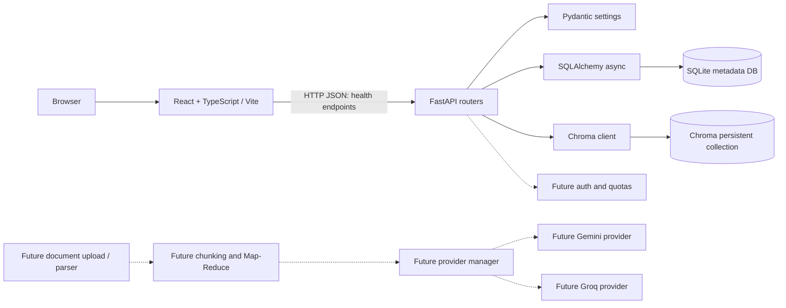

# Master Architecture

## Status and scope

This workspace was inspected before scaffolding. At inspection time it contained
an empty `.env` file and no application source, dependency manifests, tests,
deployment configuration, or Docker configuration. There was therefore no
existing React/FastAPI application to reverse-engineer.

This document distinguishes **verified workspace facts** from the **proposed
starter architecture** added in this phase. The starter establishes the React /
TypeScript and FastAPI boundaries, a SQLite metadata store, and a persistent
Chroma vector collection. It does not implement document upload, parsing,
summarization, AI providers, authentication, quotas, usage accounting, or SSE.
No Docker setup is included, per the current instruction.

## 1. Project overview and system boundaries

**Verified before changes:** no application components or service boundaries
were present.

**Starter now:** a browser-based React/TypeScript client calls a FastAPI service.
The API owns application configuration and persistence. SQLite stores relational
metadata; Chroma persists vector data on the local filesystem. There is no
external database server or AI provider wired into this starter.

```text
Browser
  └── React + TypeScript (Vite, :5173)
       └── HTTP JSON API ──> FastAPI (:8000)
                              ├── SQLAlchemy async ──> SQLite file
                              └── Chroma client ─────> Chroma local persistence
```

## 2. High-level architecture

The solid-line connections below describe the implemented starter. Dashed
components are future proposals only.



The browser/API boundary is HTTP. No SSE contract or streaming endpoint is
implemented in the starter.

## 3. Frontend architecture

**Implemented:** `frontend/` is a Vite React/TypeScript application. `src/main.tsx`
mounts the app, `src/App.tsx` displays API readiness, and `src/api/health.ts`
contains a typed fetch client for the readiness endpoint. `AbortController`
cancels the initial health request when the component unmounts. The API origin
is configurable with `VITE_API_BASE_URL`.

**Not implemented:** document-upload UI, summary views, global state management,
authentication state, routing, and SSE streaming. The starter needs no global
state library; add one only when product flows require shared client state.

## 4. Backend architecture

**Implemented:** `backend/app/main.py` creates the FastAPI app and initializes
the database and Chroma during lifespan startup. `backend/app/api/` contains
health routes. `backend/app/core/config.py` centralizes environment settings.
`backend/app/db/` provides the SQLAlchemy base, async session dependency, and a
minimal document-metadata model. `backend/app/services/vector_store.py` owns the
local Chroma client and collection setup.

Direct Python dependencies are version-pinned in `backend/requirements.txt`.
FastAPI is pinned to the version required by the selected Chroma release, and
PostHog is pinned to the compatible telemetry API used by that Chroma release.

**Not implemented:** business routers, domain services, request/response schemas
beyond health, or production database migrations. Tables are created with
SQLAlchemy metadata at startup for this scaffold; replace that development
bootstrap with Alembic migrations before production.

## 5. AI provider architecture

**Verified before changes:** no AI provider, provider manager, task routing, or
failover code existed. **Implemented now:** none; no API key is loaded or used.

**Proposed later:** define a provider interface, a provider manager, task-based
routing, and explicit timeout/retry/failover policy for Gemini and Groq. Select
the primary and fallback provider per task only after product requirements and
provider limits are confirmed. Keep credentials in untracked environment
variables or a managed secret store; never bundle them in frontend variables,
source, images, or committed files.

## 6. Document ingestion and summarization

No upload route, file validation, parser, extraction pipeline, chunker, embedding
generation, or Map-Reduce summarization exists in this starter.

**Proposed flow:** validate upload limits and file type; store document metadata
in SQLite; extract text with a format-specific parser; normalize and split into
bounded chunks; embed and persist chunks in Chroma with document/chunk metadata;
map over chunks to create partial summaries; reduce partial summaries into a
final result; persist status and usage. The exact parsers, chunk strategy,
embedding model, and retention policy remain decisions for the feature phase.

## 7. Database, authentication, quota, and usage

**Implemented:** async SQLAlchemy connects to a local SQLite file at
`backend/data/app.db` by default. The `documents` table is a minimal metadata
foundation. Chroma's persistent directory defaults to `backend/data/chroma`,
with a collection named `document_chunks`. Both locations can be configured.

**Not implemented:** users, sessions, authentication, authorization, quotas,
usage records, billing, or cross-store consistency. Chroma is a separate
persistent store; future document deletion and retention flows must remove both
relational metadata and vector records safely.

## 8. API communication and SSE contracts

**Implemented:** `GET /api/health/live` reports process liveness.
`GET /api/health/ready` checks SQLite and Chroma readiness. The frontend calls
the readiness endpoint using JSON over HTTP.

**Not implemented:** SSE or any streaming response. For a future summarization
stream, a proposed versioned event vocabulary is:

| Event | Proposed data |
| --- | --- |
| `job.started` | `job_id`, `document_id` |
| `progress` | `job_id`, `stage`, `completed`, `total` |
| `partial_summary` | `job_id`, `chunk_index`, `text` |
| `summary.completed` | `job_id`, `summary`, `usage` |
| `summary.error` | `job_id`, stable `code`, safe `message` |

These event names and shapes are proposals, not existing API contracts. Define
reconnection, heartbeat, terminal-event, and cancellation semantics alongside
the streaming feature.

## 9. Errors, retries, timeouts, cancellation, and rate limits

**Implemented:** the frontend's initial readiness request has an abort signal
on component unmount; fetch failures are shown in the UI. FastAPI exposes its
standard error responses. SQLAlchemy readiness failures are logged.

**Not implemented:** provider retries/failover, API-wide timeouts, request
cancellation propagation, rate limiting, job retry queues, or an application
error envelope. Add bounded retries only for idempotent/transient operations;
do not retry user cancellation or validation failures.

## 10. Security, privacy, files, and secrets

No document upload exists, so no file-type/size validation or malware scanning
is active. The starter restricts CORS to the configured local frontend origin
by default and excludes `.env`, local data, and virtual environments in
`.gitignore`. `.env.example` contains configuration defaults, not credentials.

Before accepting documents, add size limits, content/signature checks, safe
temporary-file handling, filename normalization, parser isolation, and a
retention/deletion policy. Add authentication and per-user authorization before
exposing stored documents. Do not log document text, tokens, or secrets.

## 11. Testing and observability

**Verified before changes:** no test suite or observability setup existed.
**Implemented now:** FastAPI's OpenAPI endpoints and standard application
logging; there is no metrics, tracing, or error-reporting integration. Frontend
and backend build/smoke checks are documented in the local workflow below.

**Proposed:** unit tests for parsers, chunking, routing, quota arithmetic, and
event serialization; API integration tests against temporary SQLite and
isolated Chroma paths; frontend component/API tests; and end-to-end tests for
upload-to-result once those features exist. Add structured request/job IDs and
redacted operational metrics before production.

## 12. Environment and deployment topology

`../.env.example` lists the starter's consumed settings. Copy values into
`backend/.env` and `frontend/.env.local`; both are ignored by Git. Backend
settings are prefixed `APP_`; frontend settings must use the Vite `VITE_`
prefix and are public to browser code.

**Verified before changes:** no deployment target or topology existed.
**Current proposal:** local development uses the Vite dev server and Uvicorn,
with SQLite and Chroma persisted to files under `backend/data/`. Production
hosting, TLS termination, backup/restore, scaling, and shared storage are
undecided. SQLite and local Chroma files are single-host development storage,
not a multi-instance deployment design. The validated local toolchain used
Python 3.11 and Node.js 24; the frontend manifest requires Node.js 22 or later
and below 25.

## 13. Docker and local development

No Dockerfile or Compose file was present. Docker has deliberately not been
added in this phase, as requested. The starter is run directly on the host:

```powershell
# Terminal 1: API
Set-Location "backend"
python -m venv .venv
.\.venv\Scripts\Activate.ps1
pip install -r requirements.txt
uvicorn app.main:app --reload

# Terminal 2: frontend
Set-Location "frontend"
npm install
npm run dev
```

Stop each process with `Ctrl+C`. Inspect interactive API docs at
`http://localhost:8000/docs`, liveness at `http://localhost:8000/api/health/live`,
and readiness at `http://localhost:8000/api/health/ready`. Local persistent data
is in `backend/data/`; remove it only when intentionally resetting local
development data.

## 14. Limitations, risks, and technical debt

- There was no original source to compare with; the scaffold is new rather than
  a modification of a verified working application.
- Summarization, Gemini/Groq, parsing, embeddings, auth, quotas, and SSE are
  intentionally absent.
- SQLite plus local Chroma are suitable for a single-host starter only.
- Startup uses `create_all`, not migrations; schema evolution needs Alembic.
- No automated test suite, frontend lint/type-check script, metrics, tracing,
  deployment manifests, or backup strategy is included.
- The API keys shared in chat are not used or stored here. Treat them as
  exposed: revoke/rotate them with their providers before any later integration.
- Docker validation is not applicable because Docker files were explicitly
  deferred. Deployment configuration remains unresolved.

## 15. Phased implementation roadmap

Dependencies are explicit; later work must not be treated as already complete.

1. **Architecture and foundation (this phase):** establish this document,
   frontend/backend boundaries, SQLite and Chroma persistence, config, and
   health endpoints. Complete before feature work.
2. **Schema and migrations:** depends on phase 1; finalize document/job/user
   entities and introduce Alembic before schema growth.
3. **Ingestion and parsing:** depends on phase 2; add secure upload, parser
   selection, extraction, document lifecycle, and tests.
4. **Chunking and embeddings:** depends on phase 3; decide chunk policy and
   embedding provider/model, persist vectors with stable identifiers.
5. **Provider abstraction and summarization:** depends on phase 4; add Gemini
   and Groq adapters, task routing, bounded failover, and Map-Reduce.
6. **Streaming and cancellation:** depends on phase 5; define and implement a
   versioned SSE contract, reconnection, progress, and cancellation semantics.
7. **Authentication, quotas, and usage:** depends on the product identity and
   persistence decisions in phase 2; enforce authorization and atomic quota
   accounting across relevant API operations.
8. **Production readiness and deployment:** depends on phases 2–7; choose
   hosting, migrations/backup, secret management, observability, rate limits,
   and whether Docker or managed database/vector services are justified.
